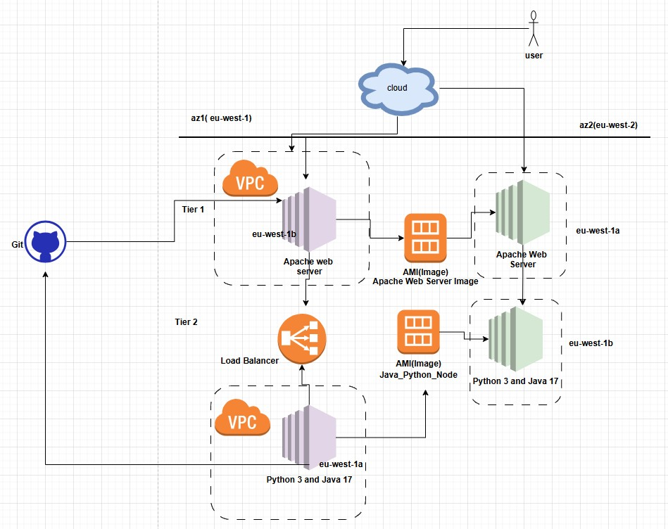

# Fruits And Veg App

A simple app to show how a 2 Tier app works. A list of **fruits** and **vegetables**

-**HTLM + JS** frontend (Tier 1) - fetches data
-**FastAPI/Python** - backend (Tier 2) provides `/fruits`

## Note

- The frontend points to python backend on `localhost:9000`. You might neet to update this

## Frontend Requirement
- install Nginx/HTTPD and deploy index.html file as required
- install git to download repo

## Backend Python Requirements
- Install git to download repo
- ensure you have python 3 on the server
- `python3 -m venv venv`  Setup required scripts 
- Activate the Virtual environment `source venv\bin/activate`
- install libraries `python -m pip install - r requirements.txt`
- run app `uvivorn main:app --port 8000 --reload` 